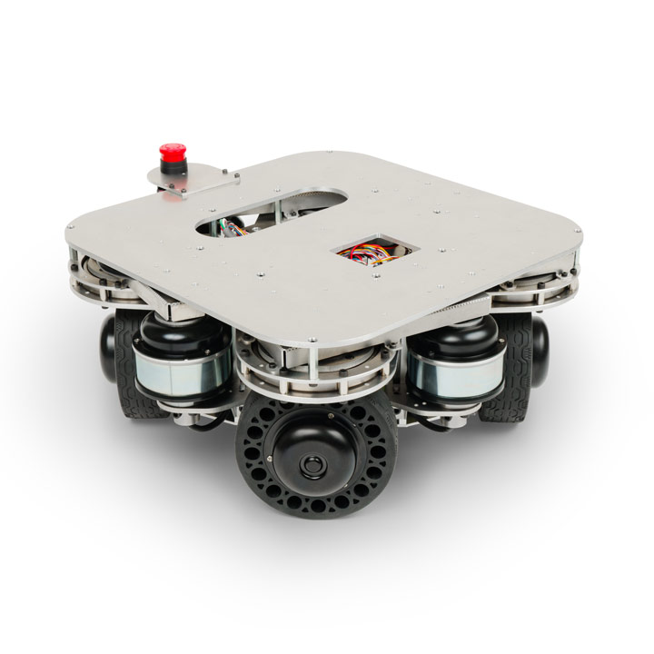

# 4WDSローバーX40A ROS2パッケージ

<p align="center">
  
</p>

ヴイストン株式会社より発売されている全方向移動台車「[4WDSローバーX40A](https://www.vstone.co.jp/products/wheelrobot/x40a.html)」等をROS 2で制御するためのパッケージです。別途Linux搭載のPC及びロボット実機が必要になります。

# 目次
<!-- TOC -->

- [概要](#%E6%A6%82%E8%A6%81)
- [必要機器 & 開発環境](#%E5%BF%85%E8%A6%81%E6%A9%9F%E5%99%A8--%E9%96%8B%E7%99%BA%E7%92%B0%E5%A2%83)
- [パッケージ構成](#%E3%83%91%E3%83%83%E3%82%B1%E3%83%BC%E3%82%B8%E6%A7%8B%E6%88%90)
- [インストール方法](#%E3%82%A4%E3%83%B3%E3%82%B9%E3%83%88%E3%83%BC%E3%83%AB%E6%96%B9%E6%B3%95)
- [使用方法](#%E4%BD%BF%E7%94%A8%E6%96%B9%E6%B3%95)
    - [URDFモデルの表示](#urdf%E3%83%A2%E3%83%87%E3%83%AB%E3%81%AE%E8%A1%A8%E7%A4%BA)
    - [メカナムローバー（実機）との通信](#%E3%83%A1%E3%82%AB%E3%83%8A%E3%83%A0%E3%83%AD%E3%83%BC%E3%83%90%E3%83%BC%E5%AE%9F%E6%A9%9F%E3%81%A8%E3%81%AE%E9%80%9A%E4%BF%A1)
        - [有線シリアル接続の場合](#%E6%9C%89%E7%B7%9A%E3%82%B7%E3%83%AA%E3%82%A2%E3%83%AB%E6%8E%A5%E7%B6%9A%E3%81%AE%E5%A0%B4%E5%90%88)
        - [Wi-Fi 接続の場合](#wi-fi-%E6%8E%A5%E7%B6%9A%E3%81%AE%E5%A0%B4%E5%90%88)
    - [odometryをpublish](#odometry%E3%82%92publish)
    - [台車ロボットをROS 2経由で遠隔操作](#%E5%8F%B0%E8%BB%8A%E3%83%AD%E3%83%9C%E3%83%83%E3%83%88%E3%82%92ros-2%E7%B5%8C%E7%94%B1%E3%81%A7%E9%81%A0%E9%9A%94%E6%93%8D%E4%BD%9C)
        - [キーボードで操作](#%E3%82%AD%E3%83%BC%E3%83%9C%E3%83%BC%E3%83%89%E3%81%A7%E6%93%8D%E4%BD%9C)
        - [マウスで操作](#%E3%83%9E%E3%82%A6%E3%82%B9%E3%81%A7%E6%93%8D%E4%BD%9C)
    - [URDFモデルのオプション有効化方法](#urdf%E3%83%A2%E3%83%87%E3%83%AB%E3%81%AE%E3%82%AA%E3%83%97%E3%82%B7%E3%83%A7%E3%83%B3%E6%9C%89%E5%8A%B9%E5%8C%96%E6%96%B9%E6%B3%95)
    - [SLAM ToolboxでSLAM](#slam-toolbox%E3%81%A7slam)
    - [SLAM gmappingでSLAM](#slam-gmapping%E3%81%A7slam)
    - [作成した地図の保存方法](#%E4%BD%9C%E6%88%90%E3%81%97%E3%81%9F%E5%9C%B0%E5%9B%B3%E3%81%AE%E4%BF%9D%E5%AD%98%E6%96%B9%E6%B3%95)
    - [Navigation2を使用したナビゲーション](#navigation2%E3%82%92%E4%BD%BF%E7%94%A8%E3%81%97%E3%81%9F%E3%83%8A%E3%83%93%E3%82%B2%E3%83%BC%E3%82%B7%E3%83%A7%E3%83%B3)
    - [gazeboを使用したシミュレーション](#gazebo%E3%82%92%E4%BD%BF%E7%94%A8%E3%81%97%E3%81%9F%E3%82%B7%E3%83%9F%E3%83%A5%E3%83%AC%E3%83%BC%E3%82%B7%E3%83%A7%E3%83%B3)
- [ライセンス](#%E3%83%A9%E3%82%A4%E3%82%BB%E3%83%B3%E3%82%B9)
- [貢献](#%E8%B2%A2%E7%8C%AE)

<!-- /TOC -->

## 概要

4WDSローバーは、前後・左右・回転を組み合わせた自由度の高い移動ができることが大きな特徴で、細かい位置制御が求められる搬送・自律移動などの研究開発プロジェクトに好適です。このパッケージでは、4WDSローバーの制御を実現するためのROS2関連の機能を提供します。

## 必要機器 & 開発環境
- 4WDSローバーX40A:
  - 製品ページ: [https://www.vstone.co.jp/products/wheelrobot/x40a.html](https://www.vstone.co.jp/products/wheelrobot/x40a.html)
  - 販売ページ: [https://www.vstone.co.jp/robotshop/index.php?main_page=product_info&products_id=5350](https://www.vstone.co.jp/robotshop/index.php?main_page=product_info&products_id=5350)
- 4WDSローバーX120A:
  - 製品ページ: [https://www.vstone.co.jp/products/wheelrobot/x120a.html](https://www.vstone.co.jp/products/wheelrobot/x120a.html)
  - 販売ページ: [https://www.vstone.co.jp/robotshop/index.php?main_page=product_info&products_id=5367](https://www.vstone.co.jp/robotshop/index.php?main_page=product_info&products_id=5367)
- Ubuntu Linux - Jammy Jellyfish (22.04)
- ROS 2 Humble Hawksbill

## ファイルの構成
   ```
    ros2_ws/src
    ├ fwdsrover_xna_ros2
    │　├ fwdsrover_xna_ros2
    │　├ fwdsrover_xna_ros2_bringup
    │　├ fwdsrover_xna_ros2_navigation
    │　└ fwdsrover_description
    ├ slam_gmapping
    ├ vs_rover_options_description
    └ ydlidar_ros2_driver
   ```

## パッケージ構成
- `fwdsrover_xna`: 4WDSローバーX40A/X120Aのメタパッケージ。
- `fwdsrover_xna_bringup`: 4WDSローバーの起動に関連するノードやlaunchファイルを提供します。
- `fwdsrover_xna_ros2_navigation`: 4WDSローバーのSLAMやnavigationに関連するノードやlaunchファイルを含んでいるパッケージです。
- `fwdsrover_description`: 4WDSローバーの物理モデルやURDFモデルを含んでいるパッケージです。
- `fwdsrover_xna_gazebo`: 4WDSローバーのgazebo起動に関連するノードやlaunchファイルを提供します。

## インストール方法

このパッケージをインストールするには、以下の手順に従ってください。

1. [こちら](https://docs.ros.org/en/humble/Installation.html)の手順に従って、ROS 2 Humbleをインストールしてください。
2. [micro-ROS](https://micro.ros.org/) Agent のセットアップ: *(実機を動かす場合のみ必要)*

   ```bash
   $ mkdir -p ~/uros_ws/src
   $ cd ~/uros_ws/src
   $ git clone -b $ROS_DISTRO https://github.com/micro-ROS/micro_ros_setup.git
   $ cd ~/uros_ws
   $ rosdep update && rosdep install --from-paths src --ignore-src -y
   $ colcon build
   $ source install/local_setup.bash

   $ ros2 run micro_ros_setup create_agent_ws.sh
   $ ros2 run micro_ros_setup build_agent.sh
   $ source install/local_setup.bash
   ```

3. このリポジトリをワークスペースにクローンしてください:

   ```bash
   $ mkdir -p ~/ros2_ws/src
   $ cd ~/ros2_ws/src
   $ git clone https://github.com/vstoneofficial/fwdsrover_xna_ros2.git
   $ git clone -b $ROS_DISTRO https://github.com/vstoneofficial/vs_rover_options_description.git
   $ sudo xargs -a ~/ros2_ws/src/fwdsrover_xna_ros2/packages.txt apt install -y
   $ rosdep install -r --from-paths . --ignore-src --rosdistro $ROS_DISTRO -y
   ```

4. ワークスペースをビルド:

   ```bash
   $ cd ~/ros2_ws
   $ colcon build --symlink-install
   ```

5. ワークスペースのオーバレイ作業:

   ```bash
   $ source ~/ros2_ws/install/local_setup.bash
   ```

6. シェルを起動時にワークスペースがオーバーレイされるように設定します。

   ```bash
   $ echo "source ~/uros_ws/install/local_setup.bash" >> ~/.bashrc 
   $ echo "source ~/ros2_ws/install/local_setup.bash" >> ~/.bashrc
   ```

## 使用方法

このパッケージには、以下の主要な機能が含まれています。（詳細は各ファイルを確認してください）

### URDFモデルの表示  
以下のコマンドを実行して、4WDSローバーのURDFモデルを表示します。
rover:=x40aの部分は、使用しているロボットに合わせて変更してください。　対応モデル x40a/x120a
   ```
   ros2 launch fwdsrover_description display.launch.py rover:=x40a
   ```

### 4WDSローバー（実機）との通信**: ROS 2とMicro-ROSを統合するためのエージェントノードを起動。
#### ● 有線シリアル接続の場合:
   ```
   ros2 run micro_ros_agent micro_ros_agent serial --dev /dev/ttyUSB0 --baudrate 921600 -v4
   ```

####  ● Wi-Fi 接続の場合:
   ```
   ros2 run micro_ros_agent micro_ros_agent udp4 --port 8888
   ```

### odometryをpublish
   pub_odomノードとrviz上可視化
   ```
   ros2 launch fwdsrover_xna_bringup robot.launch.py rover:=x40a
   ```
### 台車ロボットをROS 2経由で遠隔操作
#### キーボードで操作
キーボードを使用してロボットを操作するためのノードを起動。
   ```
   ros2 run teleop_twist_keyboard teleop_twist_keyboard --ros-args --remap cmd_vel:=rover_twist
   ```

#### マウスで操作
マウスを使用してロボットを操作するためのノードを起動。

   ```
   $ ros2 launch fwdsrover_xna_bringup mouse_teleop.launch.py
   ```

### URDFモデルのオプション有効化方法
fwdsrover_description/urdf/x40a.xacroに定義されている各種オプションはコメントの切り替えによって有効／無効を設定できます。  
ここでは、LRF TG30オプションを例に設定手順を説明します。  
1. オプションの有効化
   コメントアウトを解除して、該当オプションを読み込むようにします。

      ```
      <!-- OPTION: LRF TG30 -->
      <xacro:include filename="$(find vs_rover_options_description)/urdf/lrf/tg30_x40a.xacro" />
      ```

2. オプションの無効化
   オプションを使用しない場合は、行全体をコメントアウトしてください。

      ```
      <!-- OPTION: LRF TG30 -->
      <!-- <xacro:include filename="$(find vs_rover_options_description)/urdf/lrf/tg30_x40a.xacro" /> -->
      ```

3. 反映確認
   設定を保存後、以下のコマンドでURDFモデルを確認できます。
   RViz2上でLRF（TG30）が表示されていれば、有効化が正しく反映されています。
   rover:=x40aの部分は、使用しているロボットに合わせて変更してください。　対応モデル x40a/x120a

      ```
      ros2 launch fwdsrover_description display.launch.py rover:=x40a
      ```


### SLAM ToolboxでSLAM
ToolboxはROS2のナビゲーション機（Nav2）と一緒に使える標準的なパッケージです。  
現在も活発に更新が続いており、広い範囲での地図作成やループ修正にも対応しています。  
実際にロボットを動かす場面ではこのパッケージの利用を推奨します。
  
1. LRFオプションTG30
- [ydlidar_ros2_driver](https://github.com/YDLIDAR/ydlidar_ros2_driver.git)を`src`フォルダにクローンして、buildしてください。  
      ```
      git clone -b humble https://github.com/YDLIDAR/ydlidar_ros2_driver.git
      ```

- LRFに関するパラメータは[TG30.yaml](./mecanumrover3_bringup/params/TG30.yaml)にあります。  
> **Warning**  
> ydlidar_ros2_driverの中のydlidar_ros2_driver_node.cppを修正が必要。[詳細](https://github.com/YDLIDAR/ydlidar_ros2_driver/pull/20)

1. SLAM Toolboxの準備
下記のコマンドでSLAM Toolboxをインストールする。
   ```
   sudo apt install ros-humble-slam-toolbox
   ```

2. SLAM ToolboxでSLAMする。
- ロボット実機と通信できたら、以下のコマンドでodom publisher、ロボットのurdf表示、LiDAR関連のlaunchファイルを起動します。

   ```
   ros2 launch fwdsrover_xna_bringup nav_robot.launch.py rover:=x40a
   ```

- 新しいターミナルで以下のコマンドを使用してSLAMを開始します。

   ```
   ros2 launch fwdsrover_xna_navigation slam.launch.py rover:=x40a
   ```

- 付属のVS-C3無線コントローラもしくはROS 2のteleopで動かして、mappingする。

   - 4WDSローバー用のSLAM Toolboxのパラメータは`fwdsrover_xna_navigation`パッケージの[`config`](./fwdsrover_xna_navigation/config/) フォルダにあります。

### SLAM gmappingでSLAM
  gmappingはROS1時代から広く使われてきたSLAMの手法です。  
  ROS2版も存在しますが公式での開発はすでに終了しており、有志による移植パッケージが提供されています。  
  そのため十分なサポートは期待できず、実用利用にはあまり適していません。
  ただし学習や体験を目的に「まずは地図を作る流れを試してみたい」といった場合には活用できます。

1. [SLAM gmapping](https://github.com/Project-MANAS/slam_gmapping)を`src`フォルダにクローンして、buildしてください。

      ```
      git clone https://github.com/Project-MANAS/slam_gmapping.git
      ```

2. SLAM gmappingでSLAMする。
- ロボット実機と通信できたら、以下のコマンドでodom publisher、ロボットのurdf表示、LiDAR関連のlaunchファイルを起動します。

   ```
   ros2 launch fwdsrover_xna_bringup nav_robot.launch.py rover:=x40a
   ```

 - 新しいターミナルで以下のコマンドを使用してSLAMを開始します。

   ```
   ros2 launch fwdsrover_xna_navigation gmapping.launch.py
   ```
 - 付属のVS-C3無線コントローラもしくはROS 2のteleopで動かして、mappingする。  
   4WDSローバー用のSLAM gmappingのパラメータは[`slam_gmapping.cpp`](https://github.com/Project-MANAS/slam_gmapping/blob/eloquent-devel/slam_gmapping/src/slam_gmapping.cpp)にあります。\
   [ROS 2 workspaceにクローンした場合](../slam_gmapping/slam_gmapping/src/slam_gmapping.cpp)、変更下パラメータは下記のようになります。

      ```cpp
      base_frame_ = "base_footprint";
      maxUrange_ = 29.9;  maxRange_ = 30.0;
      minimum_score_ = 500;
      ```

### 作成した地図の保存方法  
下記のコマンドで地図を`fwdsrover_xna_ros2/fwdsrover_xna_navigation/maps/`フォルダ内に保存する。
   ```
   ros2 run nav2_map_server map_saver_cli -f ~/ros2_ws/src/fwdsrover_xna_ros2/fwdsrover_xna_navigation/maps/YOUR_MAP_NAME
   ```

### Navigation2を使用したナビゲーション
#### Nav2パッケージをインストールする。

   ```
   sudo apt install ros-humble-navigation2
   sudo apt install ros-humble-nav2-bringup
   sudo apt install ros-humble-nav2-rviz-plugins
   ```

#### Nav2でナビゲーションする。  
   引数で地図ファイルのパスを指定する方法と、launchファイル内で地図ファイルのパスを指定する方法があります。

   - launchファイル内で指定する方法  
      4WDSローバー用の地図ファイルを`fwdsrover_xna_navigation/maps/`フォルダに保存、もしくは移動させます。  
      [`navigation.launch.py`](./fwdsrover_xna_navigation/launch/navigation.launch.py#L35) の行35を探し、“ファイル名.yaml”を、先ほど保存，移動させた地図ファイルのファイル名に合わせて設定します。 
      ```
      get_package_share_directory('fwdsrover_xna_navigation'),
      'maps',
      'YOUR_MAP_NAME.yaml'))
      ```
1. ロボット実機と通信できたら、以下のコマンドでpub_odom、ロボットのurdf表示、LiDAR関連のlaunchファイルを起動します。  
   ```
   ros2 launch fwdsrover_xna_bringup nav_robot.launch.py rover:=x40a
   ```

2. 新しいターミナルで以下のコマンドを使用してナビゲーションを開始します。  
   map:=YOUR_MAP_NAMEの部分は、使用したい地図ファイルのフルパスに置き換えることでnavigation.launch.py内を書き換えずに起動することも可能です。
   ```
   ros2 launch fwdsrover_xna_navigation navigation.launch.py rover:=x40a map:=YOUR_MAP_NAME
   ```

   4WDSローバー用のNavigation2のパラメータは`fwdsrover_xna_navigation`パッケージの[`config`](./fwdsrover_xna_navigation/config/) フォルダにあります。  
roverタイプごとにパラメータファイルが分かれていますので、使用しているロボットに合わせて調整してください。

> **Warning**  
   > ナビゲーションを行う場合、移動命令のrover_twistトピックが競合しないようにするため、rover_twistをpublishするノードは起動しないでください。  
   > 付属のVS-C3無線コントローラはROS2経由で操作するわけではないため、緊急時の手動操作として使用可能です。


### gazeboシミュレーションの準備
- 初回のgazeboを起動する際に環境変数を更新します。
   ```
   source /usr/share/gazebo/setup.sh
   ```

- シェルを起動時にgazeboのオーバーレイされるように設定します。  
   ```
   echo "source /usr/share/gazebo/setup.sh" >> ~/.bashrc
   ```


### gazeboでシミュレーションする。

- 空のワールドを起動する  
床とロボットモデルのみ存在するベースワールドになります。他プログラムと連携する際に利用することを想定したlaunchファイルです。
  1. 空のワールドを起動します。
      ```
      ros2 launch fwdsrover_xna_gazebo gazebo_bringup.launch.py　rover:=x40a
      ```

  2. 壁をシミュレータ内にインポートします。  
   wall:=Wall.stlの部分は、fwdsrover_xna_gazebo/meshes内にあるSTLファイルに書き換えることで、壁としてシミュレータ内にインポートすることができます。
      ```
      ros2 launch fwdsrover_xna_gazebo spawn_wall.launch.py　wall:=Wall.stl
      ```

  3. ローバーをマウスで遠隔操作するには、新しいターミナル ウィンドウで以下のコマンドを使用して遠隔操作ノードを起動します。
      ```
      ros2 launch fwdsrover_xna_bringup mouse_teleop.launch.py
      ```

- gazeboでSLAMする  
gazebo内のワールドの地図データを作成することができます。
  1. gazebo serverとSLAMノードを起動します。
      ```
      ros2 launch fwdsrover_xna_gazebo gazebo_slam.launch.py rover:=x40a  wall:=Wall.stl
      ```

  2. ローバーをマウスで遠隔操作するには、新しいターミナル ウィンドウで以下のコマンドを使用して遠隔操作ノードを起動します。
      ```
      ros2 launch fwdsrover_xna_bringup mouse_teleop.launch.py
      ```

  3. 下記のコマンドで地図を`fwdsrover_xna_ros2/fwdsrover_xna_gazebo/maps/`フォルダ内に保存する。  
   YOUR_MAP_NAMEは保存したい地図の名前に置き換えてください。
      ```
      ros2 run nav2_map_server map_saver_cli -f ~/ros2_ws/src/fwdsrover_xna_ros2/fwdsrover_xna_gazebo/maps/YOUR_MAP_NAME
      ```

- gazeboでナビゲーションする。  
引数で地図ファイルのパスを指定する方法と、launchファイル内で地図の名前を指定する方法があります。

   - 使用する地図ファイルを適用する  
   ここではlaunchファイル内で指定する方法を説明します。   
   [`gazebo_nav.launch.py`](./fwdsrover_xna_gazebo/launch/gazebo_nav.launch.py#L35) の行35を探し、“ファイル名.yaml”を、先ほど保存した地図ファイルの名前に合わせて設定します。  

      ```
      get_package_share_directory('fwdsrover_xna_gazebo'),
      'maps',
      'YOUR_MAP_NAME.yaml'))
      ```
   
   - gazebo serverとNav2ノードを起動します。  
   map:=YOUR_MAP_NAMEの部分は、使用したい地図ファイルのフルパスに置き換えることでgazebo_nav.launch.py内を書き換えずに起動することも可能です。
      ```
      ros2 launch fwdsrover_xna_gazebo gazebo_nav.launch.py rover:=x40a  wall:=Wall.stl　map:=YOUR_MAP_NAME
      ```

   > **Warning**  
   > ナビゲーションを行う場合、移動命令のrover_twistトピックが競合しないようにするため、rover_twistをpublishするノードは起動しないでください。

## ライセンス

このパッケージはApache 2.0ライセンスの下で提供されています。詳細については、[LICENSE](./LICENSE)ファイルを参照してください。

## 貢献

バグの報告や機能の提案など、このパッケージへの貢献は大歓迎です。issueまたはメールでのお問い合わせをご利用ください。


